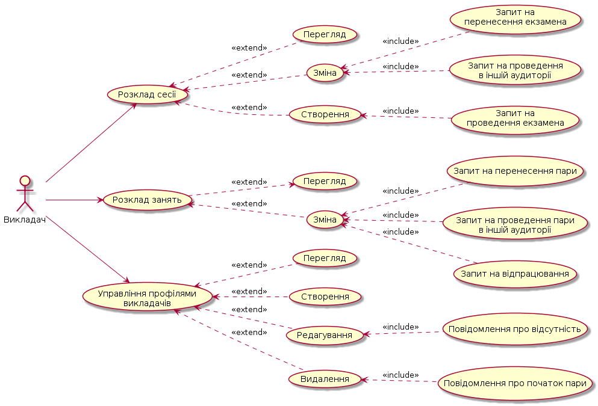
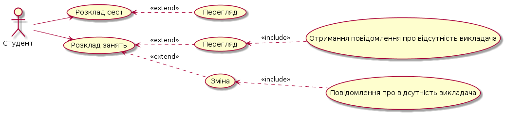
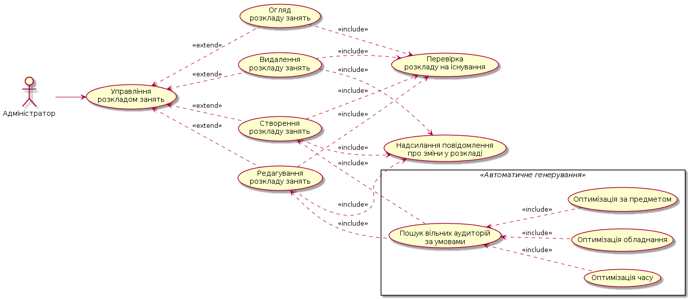

# Зміст

## 1. Короткий опис продукту
1.1 Функціональність

1.2 Системні юзкейси

## 2. ERP системи
2.1 Що таке ERP система?

2.2 Види та типи ERP систем

2.3 Особливості впровадження ERP систем у ВНЗ

2.4 SaaS як проста і гнучка модель ERP системи

2.5 Оперативне, тактичне та стратегічне планування

2.6 Підсумок

2.7 Список джерел

---

# 1. Короткий опис продукту

## 1.1 Функціональність

Основні вимоги до функціональності, що пред’являються зацікавленим особам і до предмета розробки, відносяться до *трьох категорій*:
* Зареєстрований користувач, викладач;
* Незареєстрований користувач, студент;
* Адміністратор (представник деканату).

*Можливості викладача.*

У викладача, при використанні системи, є такі можливості:
* Вхід до системи під своїм логін/паролем;
* Повідомлення про початок пари;
* Повідомлення про свою відсутність на парі;
* Створення запиту на проведення пари в іншій аудиторії;
* Створення запиту на перенос пари;
* Створення запиту на відпрацювання пари.

*Можливості студента.*

У студента, при використанні системи, є такі можливості:
* Повідомлення про відсутність викладача на поточній парі через 15 хв. після її початку;
* Перегляд розкладу занять будь-якої групи;
* Перегляд розкладу сессії будь-якої групи.

*Можливості адміністратора.*

У адміністратора, при використанні системи, є такі можливості:
* Вхід до системи під своїм логін/паролем;
* Реєстрація викладачів;
* Публікування розкладу занять;
* Корекція розкладу занять;
* Публікування розкладу сесіїї;
* Корекція розкладу сесіїї.

## 1.2 Системні юзкейси

**1.2.1 Юзкейс входу в систему під логін/паролем**

Учасники:
* Користувач, має коректний логін/пароль адміністратора або викладача;
* Система.

Передумови: користувач не авторизований в системі.

Основний сценарій:
1. Користувач натискає на кнопку “Авторизація”;
1. Система відкриває відповідну форму;
1. Користувач вводить свої данні для входу в поля “Логін” та “Пароль” і при необхідності ставить чекбокс “Запам’ятати мене в системі”;
1. Користувач натискає на кнопку “Увійти”;
1. Система обробляє данні та авторизує користувача.

Результат: Система створила сеанс роботи користувача. 

Виключні ситуації:
1. Неправильно введений логін чи пароль:
    * У формі система виводить повідомлення: «Ви ввели неправильно логін чи пароль. Перевірте введені данні».

1. Користувач не пам’ятає паролю для входу:
    * Користувач натискає на кнопку «Забули пароль?»
    * Система надсилає на введену пошту данні для входу.

**1.2.2 Юзкейс реєстрації в системі викладача адміністратором**

Учасники:
* Адміністратор;
* Система.

Передумови:
* Адміністратор авторизований в системі;
* Викладач не зареєстрований в системі.

Основний сценарій:
1. Адміністратор натискає на кнопку “Викладачі”;
1. Система відкриває відповідну сторінку;
1. Адміністратор натискає на кнопку “Зареєструвати нового викладача”;
1. Система відкриває відповідну форму;
1. Адміністратор вводить дані викладача в поля “Імя”, “Прізвище”, “По батькові”, “Факультет”, “Кафедра”, “Посада”, “Контактний телефон”, “Контактний адрес електронної пошти” та обирає відповідні пари за допомогою фільтра з полями “Предмет”, “Тип пари”, “Група”;
1. Адміністратор натискає кнопку “Зареєструвати”;
1. Система обробляє дані та надсилає викладачу на вказану пошту данні для входу.

Результат: Система створила запис для профілю викладача в базі даних.

Виключні ситуації:
1. Введеної електронної адреси не існує:
    * Система виводить повідомлення «Данної електронної адреси не існує. Перевірте введені данні.»
1. Введено некоректну електронну адресу:
    * Адміністратор натискає кнопку «Викладачі»;
    * Система відкриває сторінку для роботи з користувачами;
    * Адміністратор натискає на профіль відповідного викладача;
    * Cстема відкриває сторінку з даними викладача;
    * Адміністратор натискає на кнопку «Редагувати»;
    * Адміністратор вводить коректну електронну адресу та натискає на кнопку «Зберегти»;
    * Система змінює данні викладача в базі даних.

**1.2.3 Юзкейс генерування розкладу занять**

Учасники:
* Адміністратор;
* Система.

Передумови:
* Адміністратор авторизований в системі;
* Розклад занять не згенерований для групи.

Основний сценарій:
1. Адміністратор натискає на кнопку “Розклад занять”;
1. Система відкриває відповіну сторінку;
1. Адміністратор вводить назву групи у поле пошуку “Група” та натискає на кнопку “Пошук”;
1. Система відкриває відповідну сторінку;
1. Адміністратор натискає на кнопку “Згенерувати розклад автоматично”;
1. Система відкриває відповідну форму;
1. Адміністратор додатково визначає обмеження на максимальну кількість пар на день та тиждень;
1. Система обробляє данні та генерує розклад занять для  групи.

Результат: Система створила записи для сукупності занять в базі даних.

**1.2.4 Юзкейс корегування згенерованого розкладу занять**

Учасники:
* Адміністратор;
* Система.

Передумови:
* Адміністратор авторизований в системі;
* Розклад занять сзгенерований для групи.

Основний сценарій:
1. Адміністратор натискає на кнопку “Розклад занять”;
1. Система відкриває відповіну сторінку;
1. Адміністратор вводить назву групи у поле пошуку “Група” та натискає на кнопку “Пошук”;
1. Система відкриває відповідну сторінку;
1. Адміністратор натискає на кнопку “Скорегувати розклад”;
1. Система відкриває відповідну форму;
1. Адміністратор додатково змінює предмет, час, та аудиторію і викладача для відповідних пар;
1. Система обробляє данні та змінює розклад занять для  групи.

Результат: Система оновила записи для сукупності занять в базі даних.

Виключні ситуації:
1. Аудиторія зайнята:
    * Система виводить повідомлення: «Данна аудиторія зайнята», та повертає адміністратора до поля вводу аудиторії.
1. У викладача, є власна пара в цей час:
    * Система виводить повідомлення: «У викладача в цей час інша група», та повертає адміністратора до поля вводу викладача.

**1.2.5 Юзкейс генерування розкладу сессії**

Учасники:
* Адміністратор;
* Система.

Передумови:
* Адміністратор авторизований в системі;
* Розклад сессії не згенерований для групи.

Основний сценарій:
1. Адміністратор натискає на кнопку “Розклад сессії”;
1. Система відкриває відповіну сторінку;
1. Адміністратор вводить назву групи у поле пошуку “Група” та натискає на кнопку “Пошук”;
1. Система відкриває відповідну сторінку;
1. Адміністратор натискає на кнопку “Згенерувати розклад автоматично”;
1. Система відкриває відповідну форму;
1. Адміністратор додатково визначає часові обмеження;
1. Система обробляє данні та генерує розклад сессії для  групи.

Результат: Система створила записи для сукупності екзаменів в базі даних.

**1.2.6 Юзкейс корегування згенерованого розкладу сессії**

Учасники:
* Адміністратор;
* Система.

Передумови:
* Адміністратор авторизований в системі;
* Розклад сессії згенерований для групи.

Основний сценарій:
1. Адміністратор натискає на кнопку “Розклад сессії”;
1. Система відкриває відповіну сторінку;
1. Адміністратор вводить назву групи у поле пошуку “Група” та натискає на кнопку “Пошук”;
1. Система відкриває відповідну сторінку;
1. Адміністратор натискає на кнопку “Скорегувати розклад”;
1. Система відкриває відповідну форму;
1. Адміністратор додатково змінює час, та аудиторію і викладача для відповідних екзаменів;
1. Система змінює запис в базі даних з розкладом сесії для групи.

Результат: Система оновила записи для сукупності екзаменів в базі даних.

Виключні ситуації:
1. Аудиторія у введений час зайнята:
    * Система виводить повідомлення: «Данна аудиторія зайнята», та повертає адміністратора до поля вводу аудиторії.

1. У викладача у введений час є інша група:
    * Система виводить повідомлення: «У викладача в цей час інша група», та повертає адміністратора до поля вводу викладача.

**1.2.7 Юзкейс перегляду розкладу занять**

Учасники:
* Користувач;
* Система.

Передумови: розклад занять згенерований для групи.

Основний сценарій:
1. Користувач натискає на кнопку “Розклад занять”;
1. Система відкриває відповідну сторінку;
1. Користувач вводить назву групи у поле пошуку “Група” та натискає на кнопку “Пошук”;
1. Система відкриває сторінку із розкладом занять для введеної групи.

Результат: Система відобразила записи для сукупності занять з бази даних.

Виключні ситуації:
1. Введено некоректну групу:
    * Система виводить повідомлення: «Введеної групи не існує, перевірте введені данні» та повертає користувача до поля пошуку «Група:».

**1.2.8 Юзкейс перегляду розкладу сессії**

Учасники:
* Користувач;
* Система.

Передумови: розклад сесії згенерований для групи.

Основний сценарій:
1. Користувач натискає на кнопку “Розклад сессії”;
1. Система відкриває відповіну сторінку;
1. Користувач вводить назву групи у поле пошуку “Група” та натискає на кнопку “Пошук”;
1. Система відкриває відповідну сторінку.

Результат: Система відобразила записи для сукупності екзаменів з бази даних.
   
Виключні ситуації:
1. Введено некоректну групу:
    * Система виводить повідомлення: «Введеної групи не існує, перевірте введені данні» та повертає користувача до поля пошуку «Група:».

**1.2.9 Юзкейс повідомлення студентом про відсутність викладача на поточній парі**

Учасники:
* Студент;
* Система.

Передумови:
* Пройшло 15 хв. з початку поточної пари;
* Викладач не повідомив про відстутність на парі;
* Викладач не повідомив про початок пари.

Основний сценарій:
1. Студент натискає на кнопку “Розклад занять”;
1. Система відкриває відповіну сторінку;
1. Студент вводить назву групи у поле пошуку “Група” та натискає на кнопку “Пошук”;
1. Система відкриває відповідну сторінку;
1. Студент натискає на кнопку “...” в комірці поточної пари;
1. Система відкриває відповідну форму;
1. Студент натискає на кнопку “Викладач відстутній”;
1. Система обробляє данні.

Результат: Система створила запис інформації про відсутність певного викладача на парі.

Виключні ситуації:
1.	Некоректно введено назву групи
    * Система виводить повідомлення: «Введеної групи не існує, перевірте введені данні» та повертає користувача до поля пошуку «Група:».

**1.2.10 Юзкейс повідомлення викладачем про відсутність на парі**

Учасники:
* Викладач;
* Система.

Передумови:
* Викладач авторизований в системі;
* Викладач не повідомив про відстутність на парі;
* Викладач не повідомив про початок пари.

Основний сценарій:
1. Викладач натискає на кнопку “Розклад занять”;
1. Система відкриває відповіну сторінку;
1. Викладач вводить назву групи у поле пошуку “Група” та натискає на кнопку “Пошук”;
1. Система відкриває відповідну сторінку;
1. Викладач натискає на кнопку “...” в комірці відповідної пари;
1. Система відкриває відповідну форму;
1. Викладач натискає на кнопку “Відсутній на парі”;
1. Система обробляє данні.

Результат: Система створила запис інформації про відсутність певного викладача на парі.

Виключні ситуації:
1.	Некоректно введено назву групи
    * Система виводить повідомлення: «Введеної групи не існує, перевірте введені данні» та повертає користувача до поля пошуку «Група:».

**1.2.11 Юзкейс повідомлення викладачем про початок пари**

Учасники:
* Викладач;
* Система.

Передумови:
* Викладач авторизований в системі;
* Викладач не повідомив про відстутність на парі;
* Викладач не повідомив про початок пари.

Основний сценарій:
1. Викладач натискає на кнопку “Розклад занять”;
1. Система відкриває відповіну сторінку;
1. Викладач вводить назву групи у поле пошуку “Група” та натискає на кнопку “Пошук”;
1. Система відкриває відповідну сторінку;
1. Викладач натискає на кнопку “...” в комірці відповідної пари;
1. Система відкриває відповідну форму;
1. Викладач натискає на кнопку “Розпочав пару”;
1. Система обробляє данні.

Результат: Система створила запис інформації про початок певної пари викладачем

Виключні ситуації:
1. Некоректно введено назву групи
    * Система виводить повідомлення: «Введеної групи не існує, перевірте введені данні» та повертає користувача до поля пошуку «Група:».

**1.2.12 Юзкейс створення запиту викладачем про проведення пари в іншій аудиторії**

Учасники:
* Викладач;
* Система.

Передумови:
* Викладач авторизований в системі;
* Викладач не повідомив про відстутність на парі;
* Викладач не повідомив про початок пари;
* Викладачу не може розпочати пару в поточній аудиторії.

Основний сценарій:
1. Викладач натискає на кнопку “Розклад занять”;
1. Система відкриває відповіну сторінку;
1. Викладач вводить назву групи у поле пошуку “Група” та натискає на кнопку “Пошук”;
1. Система відкриває відповідну сторінку;
1. Викладач натискає на кнопку “...” в комірці відповідної пари;
1. Система відкриває відповідну форму;
1. Викладач натискає на кнопку “Створити запит на зміну аудиторії”;
1. Система обробляє данні та відкриває відповідну форму;
1. Викладач обирає відповідну аудиторію та натискає на кнопку “Розпочну пару в цій аудиторії”;
1. Система обробляє данні.

Результат: Система створила запис інформації про зміну аудиторії для певної пари

Виключні ситуації
1. Некоректно введено назву групи
    * Система виводить повідомлення: «Введеної групи не існує, перевірте введені данні» та повертає користувача до поля пошуку «Група:».

1. Вибрана аудиторія зайнята
    * Після обробки запиту система знаходить інформацію  про те, що у вибраній аудирії зараз повинна проводитися пара.
    * Система виводить повідомлення(текст на формі/ вспливаюче вікно): «Вибрана аудиторія зайнята»
    * Система знову виводить форму для створення запиту про проведення пари в іншій аудиторії
1. Викладач натискає «відміна» у формі створення запиту
    * Система закриває дану форму, відображає сторінку з вибором групи.

**1.2.13 Юзкейс створення запиту викладачем про перенос пари**

Учасники:
* Викладач;
* Система.

Передумови:
* Викладач авторизований в системі;
* До початку пари залишилось не менше ніж 1 день.

Основний сценарій:
1.	Викладач натискає на кнопку “Розклад занять”;
1.	Система відкриває відповіну сторінку;
1.	Викладач вводить назву групи у поле пошуку “Група” та натискає на кнопку “Пошук”;
1.	Система відкриває відповідну сторінку;
1.	Викладач натискає на кнопку “...” в комірці відповідної пари;
1.	Система відкриває відповідну форму;
1.	Викладач натискає на кнопку “Створити запит на перенос пари”;
1.	Система обробляє данні та відкриває відповідну форму;
1.	Викладач обирає дату, час, аудиторію так натискає кнопку “Подати запит”;
1.	Система обробляє данні.
1.	Система зберігає інформацію про перенос пари, виводить на сторінці «Пару успішно перенесено»

Результат: Система створила запис інформації про перенесену пару

Виключні ситуації:
1.	Некоректно введено назву групи
    * Система виводить повідомлення: «Введеної групи не існує, перевірте введені данні» та повертає користувача до поля пошуку «Група:».
1. Вибрана аудиторія зайнята
    * Після обробки запиту система знаходить інформацію  про те, що у вибраній аудирії буде проводитися пара.
    * Система виводить повідомлення(текст на формі/ вспливаюче вікно): «Вибрана аудиторія зайнята»
    *Система знову виводить форму для створення запиту про перенос пари 

1.	Викладач натискає «відміна» у формі створення запиту
    * Система закриває дану форму, відображає сторінку з вибором групи.

**1.2.14 Юзкейс видалення облікового запису викладача адміністратором**

Учасники:
* Адміністратор;
* Система.

Передумови:
* Адміністратор авторизований в системі;
* Викладач зареєстрований в системі.

Основний сценарій:
1.	Адміністратор натискає на кнопку “Викладачі”;
1.	Система відкриває сторінку для роботи з користувачами;
1.	Адміністратор натискає на кнопку “Пошук”;
1.	Система відкриває форму пошуку облікових записів;
1.	Адміністратор вводить логін користувача-викладача, обліковий запис якого потрібно видалити;
1.	Система відображає список з стовбцями логін, ім’я, користувачів, які задовольняють умовам пошуку;
1.	Адміністратор наводить курсор на певний рядок та натискає кнопку «…»;
1.	Система відображає вспливаюче вікно з функціями;
1.	Адмінастратор натискає «Видалити обліковий запис»;
1.	Система запитує адміністратора «Ви впевнені, що бажаєте видалити даний обліковий запис користувача?»;
1.	Адміністратор натискає «так».

Результат: Система видалила запис для профілю викладача з бази даних.

Виключні ситуації:
1. Некоректно введено логін користувача:
    * Система виводить повідомлення «Користувачів з даним логіном. Не знайдено. Перевірте введені данні.»

1.	Після  виводу спливаючого вікна «Видалити обліковий запис»  адміністратор натискає кнопку «ні»;
    * Система закриває дане спливаюче вікно;
    * Сисетма відображає список  користувачів;
    * Змін до списку користувачів не внесено.

---

# 2. [ERP системи](./ERP_systems.md)
